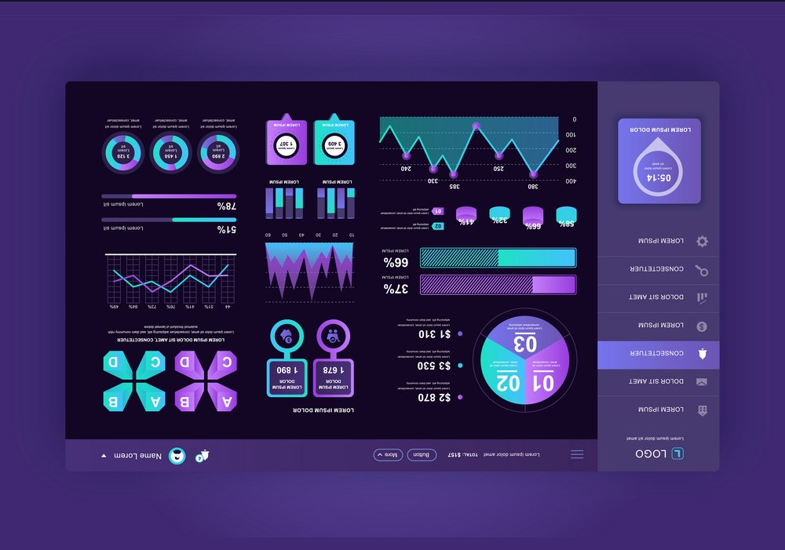

# Responsive Admin Panel Dashboard

A new Flutter project.

## Getting Started

 The dashboard is designed to adapt and function seamlessly across different devices and screen sizes, such as desktops, laptops, tablets, and mobile phones. It ensures a consistent user experience regardless of the device being used

### Dependencies

fl_chart: ^0.62.0
 
curved_navigation_bar: ^1.0.3

